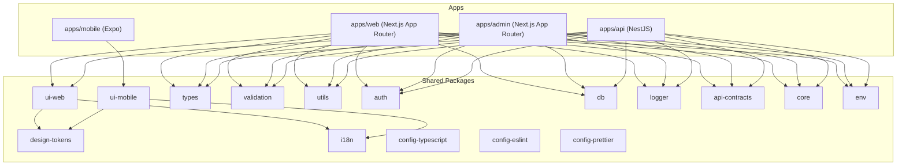

# PR 1 — Initialize the Monorepo Foundation

## Architecture Overview



## Design Decisions

- **Nx + pnpm workspaces** — Nx provides a task pipeline (caching, affected, etc.); pnpm ensures strict dependency isolation.
- `**create-nx-workspace` preset=apps\*\* — Lightest starting point; avoids opinionated defaults from heavier presets.
- **Nx generators for apps** — `@nx/next`, `@nx/expo`, `@nx/nest` generators produce correct project.json and tsconfig wiring automatically.
- `**@nx/js:lib` generator for code packages\*\* — Gives each package its own `tsconfig.json`, `src/index.ts` entry, and build target.
- **Config packages (config-eslint, config-typescript, config-prettier) scaffolded manually** — They are plain JS/JSON packages, not compiled libs.
- `**tsconfig.base.json` path aliases at root\*\* — All apps import packages via `@mono/types`, `@mono/utils`, etc. (scope: `@mono`).

## File Structure

```
mono-starter/
├── apps/
│   ├── web/          # @nx/next, App Router
│   ├── admin/        # @nx/next, App Router
│   ├── mobile/       # @nx/expo
│   └── api/          # @nx/nest
├── packages/
│   ├── ui-web/
│   ├── ui-mobile/
│   ├── design-tokens/
│   ├── i18n/
│   ├── types/
│   ├── validation/
│   ├── utils/
│   ├── auth/
│   ├── db/
│   ├── logger/
│   ├── config-eslint/
│   ├── config-typescript/
│   ├── config-prettier/
│   ├── api-contracts/
│   ├── core/
│   └── env/
├── package.json          # root scripts: dev, build, lint, test, typecheck
├── pnpm-workspace.yaml   # apps/*, packages/*
├── nx.json               # task pipeline, cacheableOperations
├── tsconfig.base.json    # @mono/* path aliases for all packages
├── .gitignore
├── .editorconfig
├── .nvmrc                # 22
└── README.md             # architecture overview
```

## Step-by-Step Implementation

### 1. Bootstrap the Nx workspace

```bash
cd /Users/ashishchopra/Projects/mono-starter
npx create-nx-workspace@latest . --preset=apps --pm=pnpm --nxCloud=skip
```

### 2. Install Nx plugins

```bash
pnpm nx add @nx/next @nx/expo @nx/nest @nx/js
```

### 3. Generate the four apps

```bash
pnpm nx g @nx/next:app apps/web   --style=css --appRouter=true --no-interactive
pnpm nx g @nx/next:app apps/admin --style=css --appRouter=true --no-interactive
pnpm nx g @nx/expo:app  apps/mobile --no-interactive
pnpm nx g @nx/nest:app  apps/api    --no-interactive
```

### 4. Generate the thirteen code packages (via `@nx/js:lib`)

Each gets: `src/index.ts`, `tsconfig.json`, `package.json` with name `@mono/<name>`.

```bash
for pkg in ui-web ui-mobile design-tokens i18n types validation utils auth db logger api-contracts core env; do
  pnpm nx g @nx/js:lib packages/$pkg --bundler=tsc --importPath=@mono/$pkg --no-interactive
done
```

### 5. Scaffold the three config packages manually

- `packages/config-typescript/` — `package.json` + `base.json`, `nextjs.json`, `nestjs.json`, `react-native.json` tsconfig presets
- `packages/config-eslint/` — `package.json` + `base.js`, `next.js`, `nest.js` ESLint flat-config exports
- `packages/config-prettier/` — `package.json` + `index.js` exporting a Prettier config object

### 6. Wire `tsconfig.base.json` path aliases

Add `@mono/*` entries pointing to each package's `src/index.ts`:

```json
{
  "compilerOptions": {
    "paths": {
      "@mono/types":          ["packages/types/src/index.ts"],
      "@mono/utils":          ["packages/utils/src/index.ts"],
      ...
    }
  }
}
```

### 7. Configure `nx.json` task pipeline

```json
{
  "targetDefaults": {
    "build": { "dependsOn": ["^build"], "cache": true },
    "lint": { "cache": true },
    "test": { "cache": true },
    "typecheck": { "dependsOn": ["^typecheck"], "cache": true }
  }
}
```

### 8. Root `package.json` scripts

```json
{
  "scripts": {
    "dev": "nx run-many -t dev",
    "build": "nx run-many -t build",
    "lint": "nx run-many -t lint",
    "test": "nx run-many -t test",
    "typecheck": "nx run-many -t typecheck"
  }
}
```

### 9. Root supporting files

- `.nvmrc` — `22`
- `.editorconfig` — 2-space indent, LF, trim trailing whitespace
- `.gitignore` — node_modules, .nx/cache, dist, .next, .expo, coverage
- `README.md` — architecture diagram, app/package descriptions, why monorepo

## Key Files After Completion

- `[pnpm-workspace.yaml](pnpm-workspace.yaml)` — `apps/*` and `packages/*` included
- `[nx.json](nx.json)` — task pipeline and cache config
- `[tsconfig.base.json](tsconfig.base.json)` — all `@mono/*` path aliases
- `[packages/config-typescript/](packages/config-typescript/)` — shared tsconfig presets for all apps
- `[README.md](README.md)` — architecture overview and monorepo rationale
