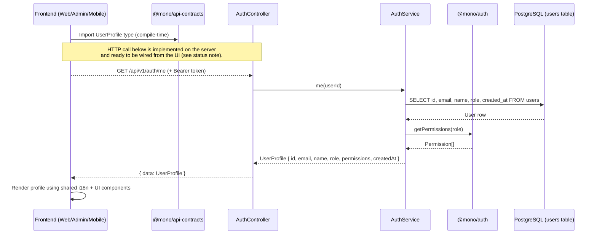
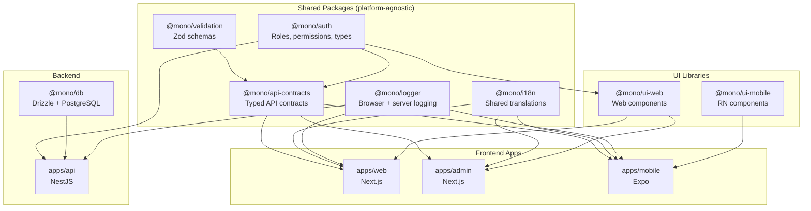

# Vertical Slice Architecture

This document explains the architecture of the mono-starter monorepo through the lens of the **"Current User Profile"** feature — the first end-to-end vertical slice that touches every layer of the stack.

## What is a Vertical Slice?

A vertical slice is a single feature implemented across all layers simultaneously — from database to UI. Unlike horizontal layers (build all DB tables, then all services, then all controllers), vertical slices deliver a complete, working feature that proves the architecture end-to-end.

## Data Flow

> **Status note (PR-15):** The backend `/auth/me` endpoint is fully implemented
> and DB-backed. The frontends currently render the profile from local
> mock-auth state (consistent with how the existing demo pages handle sign-in
> in this repo). The HTTP-fetch step is shown dashed in the diagram below — it
> is the *next* wiring step, unblocked by this slice. The frontend renders the
> same `UserProfile` shape the API returns, so swapping mock state for a real
> `fetch` is a localized change.



## Package Dependency Graph



## Layer-by-Layer Breakdown

### Layer 1: Shared Validation (`@mono/validation`)

**File:** `packages/validation/src/user-profile.ts`

Defines a Zod schema (`userProfileSchema`) that describes the shape of a user profile. This schema is:
- Used by `@mono/api-contracts` to define the API response shape
- Usable on the client for runtime validation of API responses
- The single source of truth for what a "user profile" looks like

```typescript
export const userProfileSchema = z.object({
  id: uuidSchema,
  email: emailSchema,
  name: z.string().nullable(),
  role: roleSchema,
  permissions: z.array(permissionSchema),
  createdAt: isoDateTimeSchema,
});
```

### Layer 2: API Contracts (`@mono/api-contracts`)

**File:** `packages/api-contracts/src/user-profile.contract.ts`

Defines a typed contract that specifies the HTTP method, path, and response schema for the endpoint. This contract is imported by frontend apps to ensure type-safe API consumption.

```typescript
export const userProfileContract = {
  me: {
    method: 'GET' as const,
    path: '/auth/me',
    response: successResponseSchema(userProfileSchema),
  },
} as const;
```

### Layer 3: NestJS Backend (`apps/api`)

**Files:** `auth.controller.ts`, `auth.service.ts`

The controller handles the HTTP request and delegates to the service. The service:
1. Queries the database for the user's row (excluding `passwordHash`)
2. Computes the user's permissions from their role using `@mono/auth.getPermissions()`
3. Returns the enriched `UserProfile` shape

The `@CurrentUser()` decorator extracts the authenticated user from the JWT token.

### Layer 4: Shared i18n (`@mono/i18n`)

**Files:** `packages/i18n/src/locales/en.ts`, `hi.ts`

Shared translation keys under the `profile.*` namespace are used by all frontend apps. App-specific keys (e.g., `web.profile.*`, `admin.profile.*`, `mobile.profile.*`) are defined in each app's local i18n files.

### Layer 5-7: Frontend Apps

Each app consumes the same shared packages:

| Package | Usage in Profile Feature |
|---|---|
| `@mono/auth` | `getPermissions(role)` to compute permissions client-side |
| `@mono/api-contracts` | Type reference for the API response |
| `@mono/i18n` | Shared `profile.*` translation keys |
| `@mono/logger` | `createBrowserLogger` for client-side logging |
| `@mono/ui-web` | `Card`, `Button`, `PermissionGate`, `AuthProvider` |
| `@mono/ui-mobile` | `Card`, `Button`, `Screen` for RN |

## How to Add a New Feature

Follow this pattern to add any new feature as a vertical slice:

### 1. Define the Data Shape
```
packages/validation/src/<feature>.ts
```
Create a Zod schema defining the entity/response shape.

### 2. Create the API Contract
```
packages/api-contracts/src/<feature>.contract.ts
```
Define the typed contract (method, path, query/body/response schemas).

### 3. Implement the Backend
```
apps/api/src/app/<feature>/
  ├── <feature>.module.ts
  ├── <feature>.controller.ts
  └── <feature>.service.ts
```
Create a NestJS module with controller and service. Use `@mono/db` for database queries.

### 4. Add Translations
```
packages/i18n/src/locales/en.ts    (shared keys)
apps/<app>/src/i18n/en.ts          (app-specific keys)
```

### 5. Build the UI
```
apps/web/src/app/<feature>/page.tsx
apps/admin/src/app/<feature>/page.tsx
apps/mobile/src/app/<Feature>Screen.tsx
```

### 6. Wire Up Navigation
Add links/routes from existing pages to the new feature.

## Key Principles

1. **Contracts prevent drift** — Frontend and backend agree on types via `@mono/api-contracts`.
2. **Validation is shared** — Zod schemas in `@mono/validation` are used by both contracts and backend.
3. **Auth is platform-agnostic** — `@mono/auth` provides roles, permissions, and types without any server/client-specific code.
4. **i18n has two tiers** — Shared keys in `@mono/i18n` for cross-app concepts; app-specific keys in each app's `i18n/` directory.
5. **UI follows platform conventions** — Web uses `@mono/ui-web` (Radix + CSS); mobile uses `@mono/ui-mobile` (RN primitives). Both consume the same design tokens.
6. **Logger adapts to runtime** — `createLogger` (server, pino-based) and `createBrowserLogger` (client, console-based) share the same `Logger` interface.
